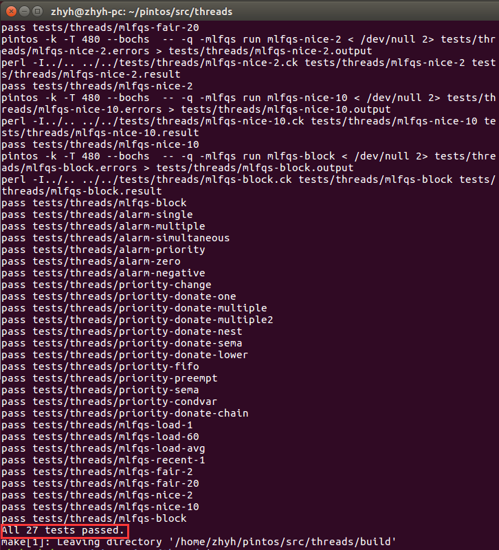
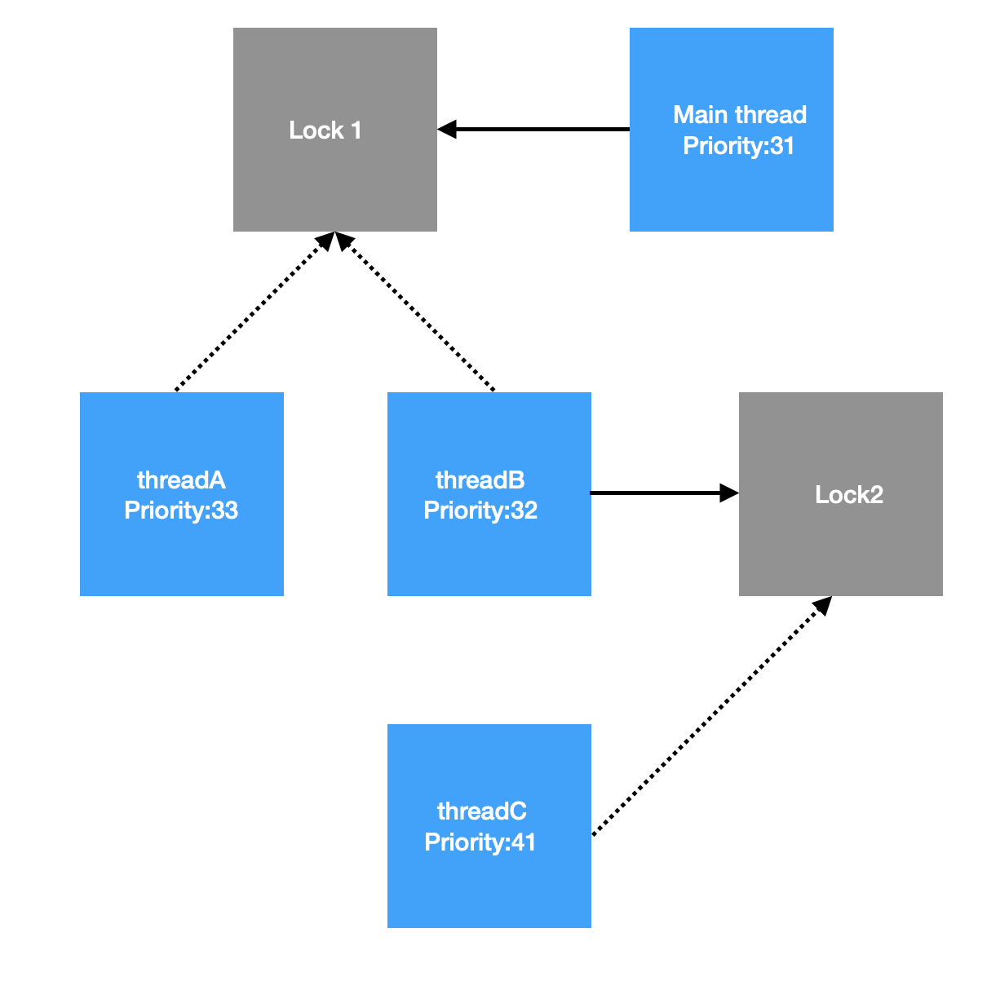

# PROJECT 1: THREADS DESIGN DOCUMENT

[TOC]

## GROUP

> Fill in the names and email addresses of your group members.

| NAME | SID | MAIL     | RATIO |
| ------ | -------- | ------------ | ---- |
| 朱英豪 | 18373722 | 18373722@buaa.edu.cn | 25%  |
| 施哲纶 | 18373044 | 18373044@buaa.edu.cn | 25%  |
| 胡鹏飞 | 18373059 | 18373059@buaa.edu.cn | 25%  |
| 朱晨宇 | 18373549 | 18373549@buaa.edu.cn | 25%  |

> 主要负责内容

| NAME   | RESPONSIBLE FOR          |
| ------ | ------------------------ |
| 朱英豪 | 需求、思路设计；文档编写 |
| 施哲纶 | 具体算法实现；文档审核   |
| 胡鹏飞 | 项目前期调研；理解Pintos |
| 朱晨宇 | 负责Debug，代码风格检查  |

> Github记录

> 样例通过情况



(具体谁完成了哪个函数的编写与Debug在代码中也有注释注明，我们的分工基本上是相当合理且平均的)

## PRELIMINARIES

> If you have any preliminary comments on your submission, notes for the
> TAs, or extra credit, please give them here.

> Please cite any offline or online sources you consulted while
> preparing your submission, other than the Pintos documentation, course
> text, lecture notes, and course staff.

1. 操作系统概念(原书第9版)/(美)Abraham Silberschatz等著
2. 原仓周老师PPT中的概念和课上讲解

## QUESTION 1: ALARM CLOCK

### 需求分析

初始程序中通过忙等待机制来实现`timer_sleep())`函数。但是这种忙等待机制的实现方式会过多的占用计算机系统的资源，对于某些资源分配不足的计算机系统（比如本组实验使用的Ubuntu虚拟机），难以通过第一部分的部分测试数据点(比如`alarm_simultaneous`)。这是因为忙等待通过轮询的方式，在每个时间片将每个线程都放入`running_list`中运行以判断是否达到睡眠时间，并且将没有达到睡眠时间的线程重新放回`ready_list`中等待下一次的轮询。使用这种忙等待机制/轮询的方法，在每一个时间片中，需要进行太多的工作，以至于在资源分配不足的情况下无法在一个时间片中执行完成本应该在一个时间片中执行完毕的工作。


如上图。iteration为0的3个thread应该在同一个tick中完成，iteration为1的thread应该在iteration=0的点完成后相差10个tick才能完成（比如后面3和4的情况那样）。但thread 2在iteration 0中，由于上文所说的原因，不能在同一个时间片中完成，与thread 1相差1个ticks，与原本设想中的每隔10个tick在一个时间片中运行3个thread的设想不符。

通过以上的需求分析，我们发现，通过忙等待机制来实现`timer_sleep`函数只能满足部分需求，而不能完美而彻底的实现题目给出的需求，因此，必须寻求新的方法方式，以满足需求的要求。

在助教的文档提示下，我们组发现可以利用线程阻塞的方式，来代替原本的忙等待的方式，能够更好地满足需求的要求。

### 设计思路

如同需求分析中所说的，我们发现，使用忙等待机制，用轮询来满足需求所要求的线程睡眠，会占用大量资源，使得无法在一个时间片中完成所有的工作，会拖延到下一个时间片中才能完成。

本组决定使用线程阻塞的方法来实现线程睡眠的方式。在具体实现的时候，本组的方法在每个时间片不再对每一个thread进行轮询。而是将thread放入`block_list`中，每个时间片检查`block_list`中的线程是否到了唤醒的时间。如果`thread`没有到规定的唤醒时间，则等待下一次时间片的查询。若是已经到了规定的唤醒时间，那么就将该线程从`block_list`中取出，放入到`ready_list`当中。

这样的做法可以节省计算机的资源。原本的方法是在每个时间片中轮询，相当于在一个时间片中依次运行所有的线程，严重浪费了计算机的资源。现在的阻塞方法免除了每个时间片依次执行的低效率，而只是简单的判断时间和队列操作，极大地提高了效率。

### DATA STRUCTURES

> A1: Copy here the declaration of each new or changed `struct` or
> `struct` member, global or static variable, `typedef`, or
> enumeration.  Identify the purpose of each in 25 words or less.

- [NEW]`int64_t ticks_blocked;`
  - 记录线程应该被阻塞的时间
- [NEW]`struct list_elem bloelem;`
  - List element：在`blocked_list`中的list element，用来存储被阻塞的线程
- [NEW]`pushin_blocked_list()`
  - 将当前线程放入`blocked_list`中
- [NEW]`static struct list blocked_list;`
  - 被阻塞的线程列表：当线程在阻塞（睡眠）过程中会被放入这个列表，在唤醒时会被移除
- [NEW]`void blocked_thread_check(struct thread *t, void *aux UNUSED)`
  - t线程需要的睡眠时间片减一；检查当前t线程是否已睡醒：如果应该在睡眠状态，则继续放在list里，否则移出`blocked_list`
- [NEW]`void blocked_thread_foreach(thread_action_func *func, void *aux)`
  - 对所有阻塞线程执行`func`,传递`aux`，必须阻塞中断

### ALGORITHMS

> A2: Briefly describe what happens in a call to timer_sleep(),
> including the effects of the timer interrupt handler.

```c
/* Sleeps for approximately TICKS timer ticks.  Interrupts must
   be turned on. */
void
timer_sleep (int64_t ticks) //zyh hpf zcy szl
{
  if (ticks <= 0){return;} 
  ASSERT (intr_get_level () == INTR_ON);
  enum intr_level old_level = intr_disable ();
  struct thread *current_thread = thread_current ();
  // 设置睡眠时间
  current_thread->ticks_blocked = ticks;
  pushin_blocked_list();
  thread_block ();
  intr_set_level (old_level);
}
```

1. 判断正在运行中的线程需要的睡眠时间是否大于0，是则执行步骤2，否则`return`
2. 禁用中断
3. 设置当前线程的`ticks_blocked`为`ticks`，即保存该线程需要睡眠的时间
4. 将该线程放入`blocked_list`队列，并设置状态为`THREAD_BLOCKED`
5. 还原线程中断状态


in `timer_interrupt()`

1. 更新当前系统时间片 
2. 遍历`blocked_list`中所有的线程，执行第3步
3. 该线程的`ticks_blocked--`
4. 判断`ticks_blocked`是否为0，如果是则执行第5步，否则遍历下一个线程，执行第3步
5. 将该线程从`blocked_list`中移除
6. 将线程放入`ready_list`队列中，并将`status`设置为`THREAD_READY`
7. 遍历下一个线程直至遍历完`blocked_list`中所有线程

**Effects**

将此时可以唤醒的程序唤醒，放入准备运行的队列，并且从阻塞队列中移除

> A3: What steps are taken to minimize the amount of time spent in
> the timer interrupt handler?

1. 每次遍历阻塞队列都会将所有被唤醒的线程移除队列，这保证了每次`timer_interrupt()`所遍历的线程都一定是沉睡的，不会有正在运行的线程或者准备运行的线程，节省了遍历的时间。
2. 在线程结构体中存储了需要沉睡的时间，在一个时间片内遍历所有沉睡的线程的结构体即可，不需要调取线程进行忙等待，大大节省了时间。

### SYNCHRONIZATION

> A4: How are race conditions avoided when multiple threads call
> timer_sleep() simultaneously?

```c
enum intr_level old_level = intr_disable ();
list_remove(&t->bloelem); // 从blocked_list中移除
thread_unblock(t); // 解锁
intr_set_level (old_level);
```

- 通过以上的原子操作，避免了竞争的发生。

> A5: How are race conditions avoided when a timer interrupt occurs
> during a call to timer_sleep()?

- 在`timer_sleep()`中将中断禁用

### RATIONALE

> A6: Why did you choose this design?  In what ways is it superior to
> another design you considered?

- 避免了忙等待问题，节省资源空间
- 牺牲空间，节省时间
  - 我们多开了一个队列，保存阻塞的睡眠线程，使得每一次tick遍历时，只需要遍历睡眠的线程，而不需要遍历所有的线程（等待运行的线程、正在运行的线程以及睡眠中的线程）

## QUESTION 2: PRIORITY SCHEDULING

我们在做这道题时，根据测试结果，将其分成了若干阶段，或称之为将问题分解为了几个Part。以下，我们将对各个Part进行需求分析与思路分析。

- Part 1: 优先队列的设计与实现
- Part 2: 优先级捐赠的设计与实现

### 需求分析

#### Part 1 (优先队列)

本组在对原始代码的实验中，发现了如下现象：


之所以会出现如下图的现象，说明用来创建线程的main thread在创建完线程之后，在唤醒新的线程之后，没有立刻交出权限，而是继续执行下去。在main thread唤醒全部的十个线程，或者是在main thread唤醒了数个线程之后，才交出main thread自己的权限，使得main thread创建的新线程有机会被执行。此时，在唤醒这些新线程的过程中，是按照这些新线程被创建的顺序依次唤醒，而不是按照新线程的权重从大到小依次唤醒，因此可以观察到，这些woke up的线程的priority是杂乱的。

而正如前文所述，根据priority.ck中给出的标准输出，不难得出需求所要求的执行思路。创建线程的main thread在创建新的线程之后，在唤醒每一个新的线程之后，都会立刻交出main thread的自身权限。同时由于main thread的priority设置为了MIN值，因此当前新创建的新线程的priority总是比main thread高的，此时代码设置信号量的资源++，手动设置多出的资源，当前新线程就会被woke up。当前新线程执行结束后，信号量资源减1，信号量资源恢复为0，回到main thread。于是main thread会执行下一次循环，创建新的线程。

对比原本的程序和目标需求，本组发现其中的差距主要有两点：一是main thread在唤醒新的线程之后继续执行没有交出权限，二是唤醒新的线程没有按照权重从大到小的顺序来唤醒。

因此，在这个问题中，我们要实现线程根据其优先级进行相应的操作，如优先级较高的线程先执行；每当有优先级高的线程进入ready list时，当前正在执行的线程也要立即将处理器移交给新的优先级更高的线程……回顾了原先线程是如何加入到list中去的——单纯的`push_back`操作，没有对线程优先级排序的操作使得此后的执行顺序皆为乱序。于是，在做这道题中，我们首先所要做的，便是设计排序算法保证每次线程插入list中时均为有序的，其次是保证线程能够正确地交出权限。

#### Part 2 (优先级捐赠)

优先级捐赠/优先级翻转问题，也就是以`priority-donate`为开头的一系列测试点。

本组综合分析了以`priority-donate-chain`, `priority-donate-lower`, `priority-donate-multiple`, `priority-donate-multiple2`, `priority-donate-nest`, `priority-donate-sema`, `priority-donate-one`为代表的测试点。在对比了`.ck`文件中的标准输出和本组在实验机上的输出答案后，本组发现了如下的问题：

当一个较低权重的线程和一个中等权重的线程同时在`ready-list`中，并且较低线程拥有一个锁，该锁同时被一个较高权重的线程acquire，那么较高权重的线程就会被锁在较低权重的线程之上，按照原本的设定，执行顺序应该为中等权重的线程，较低权重的线程，较高权重的线程。但根据标准输出的样例，则可以发现，标准的执行顺序应该是较低权重的线程，较高权重的线程，中等权重的线程。程序需要保证，权重最高的线程能够被给予尽可能多的时间，以尽可能高的顺序被执行。因此，需要将被锁在相同一个锁之上的较低权重的线程被赋予与较高权重的线程同样权重的权重，以保证能够使得较高权重的线程能够优先于中等权重的线程执行。这就是所谓的优先级捐赠。

以上根据`priority-donate-one`等简单测试点得出的需求。在更为复杂且更为综合的情况下，需要考虑更多的需求。比如，在线程释放掉锁之后，线程需要重新考虑自身的权重，或是恢复为原本的权重，或是重新从未释放的锁中获取当前最高的权重。此外，在例如`priority-donate-chain`和`multiple`等测试点中，需要考虑通过不同的锁在几个thread中连续传递（捐赠）权重的需求。

根据`priority-donate-*.c`的代码，本组对一些具有典型意义的测试点绘制出如下的概念图。

- `priority-donate-one`


- `priority-donate-multiple`


与`priority-donate-one`不同之处在于需要在释放lock B之后考虑剩下没有被释放的锁A，以及通过锁A来更新捐赠的权重。

- `priority-donate-chain`


priority-donate-chain需要考略权重通过不同的锁连续传递捐赠的权重。

- 与chain类似的结构


- `priority-donate-sema`


### 设计思路

#### Part 1 (优先队列)

首先，针对需求分析中的第一点差距：main thread没有交出权限的问题，本组发现，只需要在`sema_up()`这一唤醒函数中，添加`yield()`函数，也就是在main thread成功唤醒当前某个新线程之后，立刻交出权限，使得新线程成功唤醒。

其次，第二点差距：新线程唤醒没有按照权重从大到小的顺序，需要保证新线程唤醒有序。

我们想到了三种方式来确保有序：

1. 在线程插入至list中时，即通过比较函数，将其根据优先级顺序，插入至相应的位置。(插入$O(n)$，取出$O(1)$)
2. 不改变插入的函数，而是在取出某一个线程时，根据其优先级的要求，如取出当前list中优先级最高的线程。(插入$O(1)$，取出$O(n)$)
3. 在每一次取出时，进行排序，然后取出队列中的第一个线程。(插入$O(1)$，取出$O(nlog(n))$)

我们优先考虑时间复杂度，我们选择了方式1。该方式有三者中最快的获取线程速度。

而加入了donation部分后，所有的线程在被插入至列表中时，都有可能被donate，改变掉其priority。因此，一切在插入时进行排序的方式是无效的。所以我们在后续的实现中，多采用了方式2和3。

修改完对应相关的函数后，对于Part1的实验结果如下图：


通过了2个priority相关的测试样例点。


完成信号量、条件变量的部分后，再通过了2个点，即通过了Problem 2除`priority-donation`部分的所有点。

#### Part 2 (优先级捐赠)

本组在处理优先级捐赠系列问题(donate)之前，通过助教的文档，了解并回顾了一下优先级捐赠和优先级翻转的问题。如果需要让优先级更高的线程获得更高的执行机会。一种可行的办法是优先级捐赠，也就是在高优先级线程阻塞在低优先级线程上的时候，暂时把低优先级的线程的优先级提高，这样下次调度执行的就是这个持有锁的原本优先级很低的线程，此线程把锁释放掉以后高优先级的线程就可以得以执行了，同时被暂时提高优先级的线程的优先级需要被重置。

考虑到优先级捐赠是和lock锁相关的行为，所以在涉及到thread和锁相关系的函数中，需要补充有关于donate这一行为的部分。比如说，在`lock_acquire()`和`lock_release()`这两个相对的函数中，在获取锁和释放锁的同时，需要改变当前thread自身或者是其他thread的权重值。如果按照最简单的设计思路来考虑，那么自然很容易想到一中简单方案，即在acquire的时候，更新占有当前锁的thread的权重值，在release的时候，恢复当前thread的权重值为原始值。但是这样的思路有明显的问题，只能通过one在内的少数测试点，因为这样的捐赠方案没有办法处理类似于多个thread竞争同一个锁，多级锁连续传递线程权重等情况。

在这种简单的方案无法达成实验的目标后，需要考虑改进原有的捐赠策略。本组发现，原先的怨憎策略主要是在多个thread竞争同一个锁，多级锁连续传递线程权重等情况下无法正确的更新thread的权重值。为了解决这样的状况，本组考虑，添加两个list。在lock中添加`thread_list`用来存储acquire该lock的thread，以及当前占有该lock的thread，如此，便可以用`thread_list`中的thread的权重去更新当前占有该lock的thread的权重。在thread中添加`lock_list`，当一个thread占有了多个lock的时候，能够选取当前权重“最大”的lock。为了保证捐赠的正确性，必须在每次更新的时候，对当前thread对每个lock中的每个thread，寻找最大权重。同时，如果更新了thread的权重，则必须更新该线程“上级”的线程，也就是占有该线程acquire的锁的线程。

### DATA STRUCTURES

> B1: Copy here the declaration of each new or changed `struct` or
> `struct` member, global or static variable, `typedef`, or
> enumeration.  Identify the purpose of each in 25 words or less.

#### Part 1 (优先队列)

in `thread.c`

- [NEW]`bool list_less_cmp()`
  - 比较函数，将线程按priority排序。
- [CHANGED]`thread_create()`
  - 线程创建时，添加`yield()`。如果当前线程优先级比新创建的线程低，则当前线程需要转让资源。
- [CHANGED]`pushin_blocked_list()`
  - 修改线程插入至blocked_list中为按序插入
- [CHANGED]`thread_unblock()`
  - 修改线程插入至ready_list中为按序插入
- [CHANGED]`thread_yield()`
  - 修改线程插入至ready_list中为按序插入
- [CHANGED]`thread_set_priority()`
  - 每当线程更新(Sets the current thread's priority to NEW_PRIORITY)，添加`yield()`，直接转让资源
- [CHANGED]`init_thread()`
  - 将`list_push_back()`改为按序插入(`list_insert_ordered()`)

in `synch.c`

- [CHANGED]`sema_down()`
  - 将`list_push_back()`改为按序插入(`list_insert_ordered()`)
- [CHANGED]`sema_up (struct semaphore *sema)`
  - 添加`yield()`：由于唤醒的优先级可能更高，因为创建的线程默认最低，直接转让资源。
- [NEW]`bool list_less_sema()`
  - 比较函数，内含排序结构体。排序对象是信号量，对于排队等待信号量上的线程列表，选取所含线程中优先级最高者进行排序。
- [CHANGED]`cond_signal()`
  - 每当唤醒线程时进行排序，保证有序。

#### Part 2 (优先级捐赠)

in `thread.c/h`

- [NEW]`int original_priority;`
  - 线程原有的优先级
- [NEW]`struct list hold_lock;`
  - 线程当前占有的锁列表
- [NEW]`struct lock *acquired_lock;`
  - 线程准备请求的锁
- [NEW]`int thread_get_original_priority()`
  - 获取线程原先的优先级
- [CHANGED]`thread_set_priority()`
  - 需要添加给线程赋`original_priority`的部分
- [CHANGED]`init_thread()`
  - 线程初始化时需要设置锁相关的属性

in `synch.c/h`

- [NEW]`struct list_elem elem;`
  - list in `thread->hold_lock`
- [CHANGED]`lock_acquire()`
  - 需要递归遍历上层锁的占有线程的请求锁，向上层线程donate
  - 该锁已经获得，没有请求锁，放入该线程的占有锁的队列
- [CHANGED]`lock_release()`
  - 释放锁时，从占有锁的列表中移除
  - 遍历剩下占有锁中所有竞争线程，找到这些线程中priority的最大值，更新当前线程的priority

> B2: Explain the data structure used to track priority donation.
> Use ASCII art to diagram a nested donation.  (Alternately, submit a
> .png file.)



- Step 1: main thread acquire(1), create(33)

**Main Thread**

| Member            | Value                         |
| ----------------- | ----------------------------- |
| Priority          | 31                            |
| Priority_original | 31                            |
| is_donated        | False                         |
| Locks             | {lock_1 (priority_lock = -1)} |
| Lock_blocked_by   | NULL                          |

**Thread A**

| Member            | Value |
| ----------------- | ----- |
| Priority          | 33    |
| Priority_original | 33    |
| is_donated        | False |
| Locks             | {}  |
| Lock_blocked_by   | NULL  |

- Step 2: B acquire (1)

**Main Thread**

| Member            | Value                         |
| ----------------- | ----------------------------- |
| Priority          | 33                            |
| Priority_original | 31                            |
| is_donated        | True                          |
| Locks             | {lock_1 (priority_lock = -1)} |
| Lock_blocked_by   | NULL                          |

**Thread A**

| Member            | Value                         |
| ----------------- | ----------------------------- |
| Priority          | 33                            |
| Priority_original | 33                            |
| is_donated        | False                         |
| Locks             | {}                          |
| Lock_blocked_by   | {lock_1 (priority_lock = -1)} |

- Step 3: main thread: create(32), C:acquire(2), acquire(1)

**Main Thread**

| Member            | Value                         |
| ----------------- | ----------------------------- |
| Priority          | 33                            |
| Priority_original | 31                            |
| is_donated        | True                          |
| Locks             | {lock_1 (priority_lock = -1)} |
| Lock_blocked_by   | NULL                          |

**Thread A**

| Member            | Value                         |
| ----------------- | ----------------------------- |
| Priority          | 33                            |
| Priority_original | 33                            |
| is_donated        | False                         |
| Locks             | NULL                          |
| Lock_blocked_by   | {lock_1 (priority_lock = -1)} |

**Thread B**

| Member            | Value                         |
| ----------------- | ----------------------------- |
| Priority          | 32                            |
| Priority_original | 32                            |
| is_donated        | False                         |
| Locks             | {lock_2 (priority_lock = -1)} |
| Lock_blocked_by   | {lock_1 (priority_lock = -1)} |

- Step 4: main thread: create(41), D: acquire(2)

**Main Thread**

| Member            | Value                         |
| ----------------- | ----------------------------- |
| Priority          | 41                            |
| Priority_original | 31                            |
| is_donated        | True                          |
| Locks             | {lock_1 (priority_lock = -1)} |
| Lock_blocked_by   | NULL                          |

**Thread A**

| Member            | Value                         |
| ----------------- | ----------------------------- |
| Priority          | 33                            |
| Priority_original | 33                            |
| is_donated        | False                         |
| Locks             | {}                          |
| Lock_blocked_by   | {lock_1 (priority_lock = -1)} |

**Thread B**

| Member            | Value                         |
| ----------------- | ----------------------------- |
| Priority          | 41                            |
| Priority_original | 32                            |
| is_donated        | True                          |
| Locks             | {lock_2 (priority_lock = -1)} |
| Lock_blocked_by   | {lock_1 (priority_lock = -1)} |

**Thread C**

| Member            | Value                         |
| ----------------- | ----------------------------- |
| Priority          | 41                            |
| Priority_original | 41                            |
| is_donated        | False                         |
| Locks             | {}                          |
| Lock_blocked_by   | {lock_2 (priority_lock = -1)} |

- Step 5: main thread: release(1)

**Main Thread**

| Member            | Value |
| ----------------- | ----- |
| Priority          | 31    |
| Priority_original | 31    |
| is_donated        | True  |
| Locks             | NULL  |
| Lock_blocked_by   | NULL  |

**Thread A**

| Member            | Value                         |
| ----------------- | ----------------------------- |
| Priority          | 33                            |
| Priority_original | 33                            |
| is_donated        | False                         |
| Locks             | {}                          |
| Lock_blocked_by   | {lock_1 (priority_lock = -1)} |

**Thread B**

| Member            | Value                                                       |
| ----------------- | ----------------------------------------------------------- |
| Priority          | 41                                                          |
| Priority_original | 32                                                          |
| is_donated        | True                                                        |
| Locks             | {lock_2 (priority_lock = -1)},{lock_1 (priority_lock = -1)} |
| Lock_blocked_by   | NULL                                                        |

**Thread C**

| Member            | Value                         |
| ----------------- | ----------------------------- |
| Priority          | 41                            |
| Priority_original | 41                            |
| is_donated        | False                         |
| Locks             | {}                          |
| Lock_blocked_by   | {lock_2 (priority_lock = -1)} |

### ALGORITHMS

> B3: How do you ensure that the highest priority thread waiting for
> a lock, semaphore, or condition variable wakes up first?

在DATA STRUCTURE部分，我们已经指明有三种方式可以做到有序：

1. 在线程插入至list中时，即通过比较函数，将其根据优先级顺序，插入至相应的位置。(插入$O(n)$，取出$O(1)$)
2. 不改变插入的函数，而是在取出某一个线程时，根据其优先级的要求，如取出当前list中优先级最高的线程。(插入$O(1)$，取出$O(n)$)
3. 在每一次取出时，进行排序，然后取出队列中的第一个线程。(插入$O(1)$，取出$O(nlog(n))$)

我们优先考虑时间复杂度，我们选择了方式1。该方式有三者中最快的获取线程速度。

而加入了donation部分后，所有的线程在被插入至列表中时，都有可能被donate，改变掉其priority。因此，一切在插入时进行排序的方式是无效的。所以我们在后续的实现中，多采用了方式2和3。

> B4: Describe the sequence of events when a call to lock_acquire()
> causes a priority donation.  How is nested donation handled?

调用`lock_acquire()`时，先禁用中断，最后会恢复中断。对于该函数的执行事件，详细见如下代码注释：

```c
void
lock_acquire (struct lock *lock)
{
  ASSERT (lock != NULL);
  ASSERT (!intr_context ());
  ASSERT (!lock_held_by_current_thread (lock));
  
  thread_current()->acquired_lock=lock;
  // 设置当前线程的请求锁
  struct lock *tmp=lock;
  // 将lock赋给中间变量tmp

  while(tmp!=NULL && tmp->holder!=NULL && tmp->holder->priority<thread_current()->priority){
    // 递归遍历上层锁的占有线程的请求锁，向上层线程donate
    // 只有当上层的priority小于当前的priority时，才能向上递归
    // (因为向上递归的priority必定是非递减的，而且我们只需要donate比当前线程小的线程)
    tmp->holder->priority=thread_current()->priority;
    // tmp的占有线程的priority更新为当前线程的priority (donate)
    tmp = tmp->holder->acquired_lock;
    // 把tmp变成被donate掉的线程所请求的锁
  }

  sema_down (&lock->semaphore);
  // 请求信号量：如果没有请求到，则在该信号量上阻塞；如果请求到了，则该信号量的资源数减一。

  thread_current()->acquired_lock=NULL;
  // 该锁已经获得，没有请求锁

  list_push_back(&thread_current()->hold_lock,&lock->elem);
  // 放入该线程的占有锁的队列

  lock->holder = thread_current();
  // 更新锁的占有线程为当前线程
}
```

这样设计`lock_acquire()`可以解决nested donation：

- 递归设计的donate，可以保证所有的上层线程都被更新到
- 上层线程的更新可以保证下层线程的更先执行

> B5: Describe the sequence of events when lock_release() is called
> on a lock that a higher-priority thread is waiting for.

```c
void
lock_release (struct lock *lock) 
{
  ASSERT (lock != NULL);
  // 确保该锁非空
  ASSERT (lock_held_by_current_thread (lock));
  // 确保是当前线程拥有的该锁

  list_remove(&lock->elem);
  // 释放锁，从占有锁的列表中移除

  lock->holder = NULL;
  // 锁的占有者为空

  struct list_elem *e;
  int max_priority = thread_current()->original_priority;
  // 先设置当前线程的原始优先级设为max_priority

  for(e=list_begin(&thread_current()->hold_lock);e!=list_end(&thread_current()->hold_lock);e=list_next(e)){
    // 遍历线程占有的锁
    struct lock *tmplock= list_entry(e, struct lock ,elem);
    struct list_elem *b;
    for (b=list_begin(&tmplock->semaphore.waiters);b!=list_end(&tmplock->semaphore.waiters);b=list_next(b)){
      struct thread *tmpthread = list_entry(b,struct thread ,elem);
      if(tmpthread->priority>max_priority)max_priority=tmpthread->priority;
      // 从该锁的所有竞争线程，找到这些线程中priority的最大值，更新当前线程的priority   
    }
  }
  
  thread_current()->priority=max_priority;
  // 设置当前线程的原始优先级为刚刚找到的max_priority
  
  sema_up (&lock->semaphore);
  // 锁被释放，该锁的信号量值++，变为1
}
```

### SYNCHRONIZATION

> B6: Describe a potential race in thread_set_priority() and explain
> how your implementation avoids it.  Can you use a lock to avoid
> this race?

```c
void
thread_set_priority (int new_priority) 
{
  struct thread *cur=thread_current();
  // 获取到当前运行的线程
  cur->original_priority = new_priority;
  // 当前运行线程的原优先级为所要赋的新值

  if(list_empty(&cur->hold_lock)||new_priority>cur->priority){
    // 只有当该线程不占有任何锁，即不可能被donate，或者更新的priority大于当前priority，需要强制更新。
    // 此时才更新actual priority
    // 若此时另一个线程donate了，可能会产生冲突！
    cur->priority = new_priority;
    // 该线程的当前priority为new_priority
  }

  thread_yield();
  // 交出该线程的资源
}
```

在优先级捐赠过程中，持有锁的线程可能会因为被捐赠优先级而改变priority。若线程本身也要改变其priority，二者的执行顺序不同，可能造成混乱。

我们的实现方式中需要通过禁用中断来避免这种冲突的存在。可以用锁：给所有的运行线程上锁，即模拟成单线程。

### RATIONALE

> B7: Why did you choose this design?  In what ways is it superior to
> another design you considered?

在DATA STRUCTURE部分，我们已经指明有三种方式可以做到有序：

1. 在线程插入至list中时，即通过比较函数，将其根据优先级顺序，插入至相应的位置。(插入$O(n)$，取出$O(1)$)
2. 不改变插入的函数，而是在取出某一个线程时，根据其优先级的要求，如取出当前list中优先级最高的线程。(插入$O(1)$，取出$O(n)$)
3. 在每一次取出时，进行排序，然后取出队列中的第一个线程。(插入$O(1)$，取出$O(n \times log(n))$)

我们优先考虑时间复杂度，选择了方式1。该方式有三者中最快的获取线程速度。

而加入了donation部分后，所有的线程在被插入至列表中时，都有可能被donate，改变掉其priority。因此，一切在插入时进行排序的方式是无效的。所以我们在后续的实现中，多采用了方式2和3。

## QUESTION 3: ADVANCED SCHEDULER

### 需求分析

这一部分的基本需求是实现一个更为合理的调度(MLFQS)，同时需要实现浮点数的功能。

通用调度程序的目标是平衡线程的不同调度需求。执行大量I/O操作的线程需要快速的响应时间来保持输入和输出设备的繁忙，但是只需要很少的CPU时间。另一方面，计算任务比较多的线程需要花费大量CPU时间才能完成工作，但不需要快速响应时间。其他线程介于两者之间，I/O周期与计算周期互相交叠，因此要求随时间而变化。设计良好的调度程序通常可以同时满足所有这些要求。

MLFQS(多级反馈队列调度程序)即为可以实现该目的的一种调度方式，我们在本题中需要实现它。在该调度程序中，为了平衡线程的不同调度需求，我们要根据若干参数，来更新线程的priority，使得线程以更合理的方式先后执行。其中，`recent_cpu`、`last_cpu`、`load_avg`等数值都可对priority有影响。

计算优先级需要用到`recent_cpu`和`last_cpu`等数值，这些数值以及与这些数值有关的多种计算的中间结果和最终结果，很大可能性不是一个整数，必须用浮点数来进行计算和表示。由于Pintos的内核不支持浮点数这一功能，在这种情况下，需求和功能之间的不匹配或多或少产生了一些不可避免也不可忽视的矛盾。

面对这样的矛盾，就产生了另一个需求：如何用已有的功能去实现浮点数的表示和运算。如果再将这个功能进一步地细化，作出具体的阐述，那么就是，如何在Pintos这种不支持浮点数表示和运算的内核中，利用已有的整数的表示和运算，从而拓展到浮点数的领域上来。如果将这样的需求化简，用更为简洁的语言来描述的话，也可以说，使用整数来描述浮点数的存储与运算。

本组将目光投向了Pintos项目的官方文档中，通过学习官方文档的内容，本组得知了这一部分的计算公式。

每个线程有一个直接在其控制下的-20到20之间的`nice`值。每个线程还有一个优先级，介于0（`PRI_MIN`）到63（`PRI_MAX`）之间，并且每四个tick使用以下公式计算一次：

$$priority = PRI\_MAX - (recent\_cpu / 4) - (nice \times 2)$$

`recent_cpu`表示线程“最近”收到的CPU时间。在每个tick中，正在运行的线程的`recent_cpu`会增加1。每秒钟，每个线程的`recent_cpu`都将以这种方式使用如下公式更新：

$$recent\_cpu = (2 \times load\_avg)/(2 \times load\_avg + 1) \times recent\_cpu + nice$$

`load_avg`用来评估过去一分钟准备运行的平均线程数。它在boot时初始化为0，并且每秒钟重新计算一次：

$$load\_avg = (59/60)\times load\_avg + (1/60)\times ready\_threads$$

其中`ready_threads`是在更新时正在运行或准备运行的线程数（不包括空闲线程）。

在上面的公式中，`priority`，`nice`和`ready_threads`是整数，而`last_cpu`和`load_avg`是实数。不幸的是，Pintos在内核中不支持浮点运算，因为它会使内核复杂化并减慢其速度。出于相同的原因，实际内核通常具有相同的限制。这意味着必须使用整数来模拟实际数量的计算。

### 设计思路

本组综合分析以上的需求分析以及其中的具体公式，经过仔细的思考和广泛的讨论后，得出了初步的结论，就是使用整数来表示浮点数。回顾以前的学习内容中，我们知道整数和浮点数的表示方法，以及它们之间的相同与不同之处。考虑到以上情况，本组逐渐细化原本较为粗糙而模糊的初步结论，将初步结论进一步细化阐述。

在本次的Pintos实验中，用整数表示浮点数的基本思想是将整数的最右边的位视为代表小数。例如，我们可以将带符号的32位整数的最低14位指定为小数位，使得整数x表示实数$x/(2 >> 14)$。

这被称为$17.14$定点数字表示形式，因为小数点前有17位，小数点后有14位，以及一个符号位。$17.14$格式的数字最多表示$(2 >> 31-1)/(2 >> 14)$，约等于$131,071.999$。

比如要计算上文需求分析中提到的$\frac{59}{60}$，就用$\frac{59}{60} \times 2^{14}=16110$得出结果存储进去。

但是，考虑到如果有$\frac{59}{60} \times \frac{59}{60}$略小于1,而$16111\times 16111=259564321$远大于$2^{14}=16384$，需要再向右移动14位$259564321 \div 2^{14}=15842=2^{14} \times 0.97$才是正确的答案。同时，乘法可能会导致溢出问题。所以我们考虑使用`int64_t`来存储整数形式的浮点数。

### DATA STRUCTURES

> C1: Copy here the declaration of each new or changed `struct` or
> `struct` member, global or static variable, `typedef`, or
> enumeration.  Identify the purpose of each in 25 words or less.

in `thread.c/h`

- [NEW]`int nice;`
  - 题目中所必需的nice值
- [NEW]`int64_t recent_cpu;`
  - 题目中所必需的recent_cpu值
- [NEW]`void update_cpu(struct thread *t, void *aux UNUSED);`
  - 根据题目要求，编写该函数，以更新`recent_cpu`值
- [NEW]`void update_priority(struct thread *t, void *aux UNUSED);`
  - 根据题目要求，编写该函数，以更新线程的priority值
- [NEW]`void update_load_avg(void);`
  - 根据题目要求，编写该函数，以更新`load_avg`值
- [NEW]`void increment_recent_cpu(void);`
  - 根据题目要求，编写该函数，以递增`recent_cpu`值
- [CHANGED]`void thread_set_nice (int nice UNUSED);`
  - implemented
- [CHANGED]`void thread_init(void)`
  - 初始化`load_avg=0`
- [CHANGED]`int thread_get_nice (void)`
  - implemented. Returns the current thread's nice value.
- [CHANGED]`int thread_get_load_avg(void)`
  - implemented. Returns 100 times the current system load average, rounded to the nearest integer.
- [CHANGED]` int thread_get_recent_cpu (void)`
  - implemented. Returns 100 times the current thread's recent_cpu value, rounded to the nearest integer.

in `timer.c`

- [CHANGED]`static void timer_interrupt (struct intr_frame *args UNUSED)`
  - 根据题意update `load_avg`, `recent_cpu`, `priority`

[NEW] `fixed-point.h`

- 以宏定义的方式，添加浮点数相关运算

### ALGORITHMS

> C2: Suppose threads A, B, and C have nice values 0, 1, and 2.  Each
> has a recent_cpu value of 0.  Fill in the table below showing the
> scheduling decision and the priority and recent_cpu values for each
> thread after each given number of timer ticks:

| timer ticks | recent_cpu A | recent_cpu B | recent_cpu C | priority A | priority B | priority C | thread to run |
| ---------- | ------------ | ------------ | ------------ | ---------- | ---------- | ---------- | ------------- |
| 0          | 0            | 1            | 2            | 63         | 61         | 59         | A             |
| 4          | 4            | 1            | 2            | 62         | 61         | 59         | A             |
| 8          | 8            | 1            | 2            | 61         | 61         | 59         | B             |
| 12         | 8            | 5            | 2            | 61         | 60         | 59         | A             |
| 16         | 12            | 5            | 2            | 60         | 60         | 59         | B             |
| 20         | 12           | 9            | 2            | 60         | 59         | 59         | A             |
| 24         | 16           | 9            | 2            | 59         | 59         | 59         | C             |
| 24         | 16           | 9           | 6           | 59         | 59         | 58         | B             |
| 32         | 16           | 13           | 6           | 59         | 58         | 58         | A             |
| 36         | 20           | 13           | 6           | 58         | 58         | 58         | C             |

> C3: Did any ambiguities in the scheduler specification make values
> in the table uncertain?  If so, what rule did you use to resolve
> them?  Does this match the behavior of your scheduler?

我们按照[文档：BSD Schedular](http://www.scs.stanford.edu/15wi-cs140/pintos/pintos_7.html)计算priority的值时，存在模糊情况——两个线程的priority相同，无法确定哪个线程run。

由于我们使用的是线程插入至list的方式，在priority相同的情况下，先插入的线程会排在list的更前面，其转至running的状态也会更先，即FCFS调度。

此外，本题因为timer ticks都小于100，所以不需要更新`load_avg`以及每个线程的`recent_cpu`（由于CPU计算需要耗费一定的时间，将这部分的时间加至`recent_cpu`中，也会造成值的不确定）。

> C4: How is the way you divided the cost of scheduling between code
> inside and outside interrupt context likely to affect performance?

在我们的实现中，由于内核中断的优先更高，我们在内核中不进行调度，所有的调度都在中断外进行。

### RATIONALE

> C5: Briefly critique your design, pointing out advantages and
> disadvantages in your design choices.  If you were to have extra
> time to work on this part of the project, how might you choose to
> refine or improve your design?

我们在完成该部分实验时，基本上就是完全参照官方文档对问题的描述一步步去写的。

优点：

- 使用`int64_t`，模拟了浮点计算，提高了精度。
- 通过引用`recent_cpu`、`load_av`g、`nice`来更新所有线程priority的思想使调度更为合理。

缺点：

- 计算过程占用了大量的资源。

如果有更多的时间，我们或许会再去尝试其他更优的调度方式。

> C6: The assignment explains arithmetic for fixed-point math in
> detail, but it leaves it open to you to implement it.  Why did you
> decide to implement it the way you did?  If you created an
> abstraction layer for fixed-point math, that is, an abstract data
> type and/or a set of functions or macros to manipulate fixed-point
> numbers, why did you do so?  If not, why not?

在`fixed-point.h`中，我们通过宏定义的方式实现了浮点数相关的运算。

```c
#ifndef FIXED_POINT_H
#define FIXED_POINT_H

#define p 17
#define q 14
#define f (1<<q)

#define CONVERT_N_TO_FIXED_POINT(n)             ((n)*(f))
#define CONVERT_X_TO_INTEGER_ZERO(x)            ((x)/(f))
#define CONVERT_X_TO_INTEGER_NEAREST(x)         (((x)>=0)?(((x)+(f)/2)/(f)):(((x)-(f)/2)/(f)))

#define ADD_X_AND_Y(x,y)                        ((x)+(y))
#define SUBTRACT_Y_FROM_X(x,y)                  ((x)-(y))
#define ADD_X_AND_N(x,n)                        ((x)+(n)*(f))
#define SUBTRACT_N_FROM_X(x,n)                  ((x)-(n)*(f))
#define MULTIPLY_X_BY_Y(x,y)                    (((int64_t) (x))*(y)/(f))
#define MULTIPLY_X_BY_N(x,n)                    ((x)*(n))
#define DIVIDE_X_BY_Y(x,y)                      (((int64_t) (x))*(f)/(y))
#define DIVIDE_X_BY_N(x,n)                      ((x)/(n))

#endif
```

宏定义作为仅字符串的替换，会在编译之前即被处理掉，不会占用内存。而编写函数的方式会被编译，会给它分配内存，占用更多的资源。

因此，我们选用宏的方式抽象出`fixed-point.h`更快和更好。

## SURVEY QUESTIONS

Answering these questions is optional, but it will help us improve the
course in future quarters.  Feel free to tell us anything you
want--these questions are just to spur your thoughts.  You may also
choose to respond anonymously in the course evaluations at the end of
the quarter.

> In your opinion, was this assignment, or any one of the three problems
> in it, too easy or too hard?  Did it take too long or too little time?

All of these three are too hard for our team. It takes us over 100 hours to finish the assignment!

> Did you find that working on a particular part of the assignment gave
> you greater insight into some aspect of OS design?

Yes. Especially the last part (BSD Scheduler) -- take more aspects in OS into account, the thought of balancing threads' different scheduling needs...

> Is there some particular fact or hint we should give students in
> future quarters to help them solve the problems?  Conversely, did you
> find any of our guidance to be misleading?

No. The guidance is quite clear.

> Do you have any suggestions for the TAs to more effectively assist
> students, either for future quarters or the remaining projects?

It is recommended that when doing experiments, the TAs should first familiarize us with the OS, not let us explore it ourselves.

> Any other comments?

Thank You To All The Teaching Assistants!