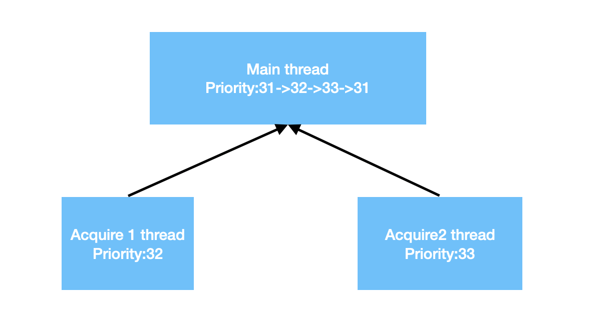
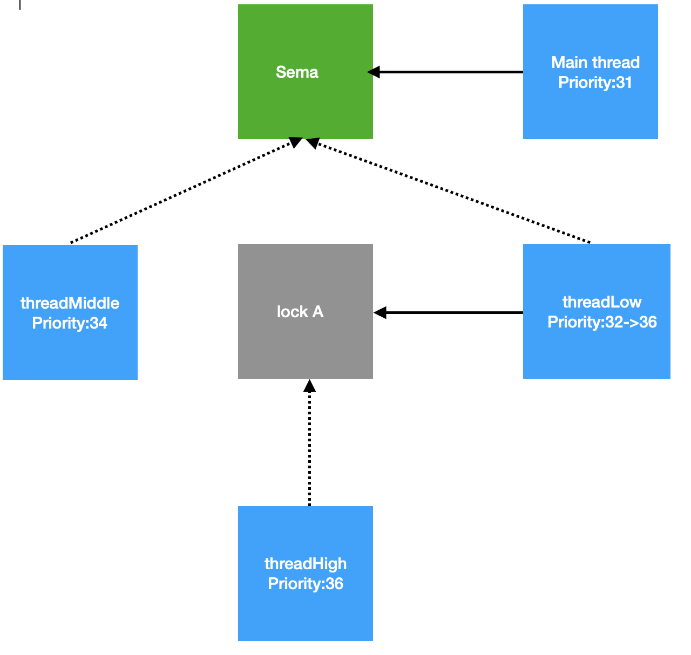
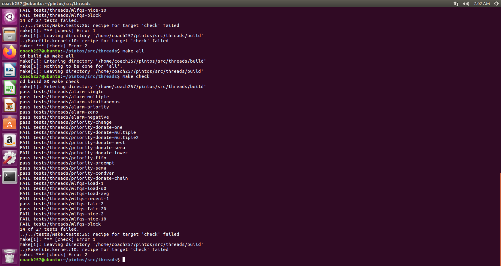

# PROJECT 1: THREADS DESIGN DOCUMENT

## GROUP

> Fill in the names and email addresses of your group members.

| NAME | SID | MAIL     | RATIO |
| ------ | -------- | ------------ | ---- |
| 朱英豪 | 18373722 | 18373722@buaa.edu.cn | 25%  |
| 施哲纶 | 18373044 | 18373044@buaa.edu.cn | 25%  |
| 胡鹏飞 | 18373059 | 18373059@buaa.edu.cn | 25%  |
| 朱晨宇 | 18373549 | 18373549@buaa.edu.cn | 25%  |

> 主要负责内容

| NAME   | RESPONSIBLE FOR          |
| ------ | ------------------------ |
| 朱英豪 | 需求、思路设计；文档编写 |
| 施哲纶 | 具体算法实现；文档审核   |
| 胡鹏飞 | 项目前期调研；理解Pintos |
| 朱晨宇 | 负责Debug，代码风格检查  |

> Github记录

> 样例通过情况

(具体谁完成了哪个函数的编写与Debug在代码中也有注释注明，我们的分工基本上是相当合理且平均的)

## PRELIMINARIES

> If you have any preliminary comments on your submission, notes for the
> TAs, or extra credit, please give them here.

> Please cite any offline or online sources you consulted while
> preparing your submission, other than the Pintos documentation, course
> text, lecture notes, and course staff.

1. 操作系统概念(原书第9版)/(美)Abraham Silberschatz等著
2. 原仓周老师PPT中的概念和课上讲解

## QUESTION 1: ALARM CLOCK

### 需求分析

初始程序中通过忙等待机制来实现`timer_sleep`函数。但是这种忙等待机制的实现方式会过多的占用计算机系统的资源，对于某些资源分配不足的计算机系统（比如本组实验使用的Ubuntu虚拟机），难以通过第一部分的部分测试数据点(比如`alarm_simultaneous`)。这是因为忙等待通过轮询的方式，在每个时间片将每个线程都放入`running_list`中运行以判断是否达到睡眠时间，并且将没有达到睡眠时间的线程重新放回`ready_list`中等待下一次的轮询。使用这种忙等待机制/轮询的方法，在每一个时间片中，需要进行太多的工作，以至于在资源分配不足的情况下无法在一个时间片中执行完成本应该在一个时间片中执行完毕的工作。


如上图。iteration 为0的三个threads应该在同一个ticks中完成，iteration为1的thread应该在iteration=0的点完成后相差10个ticks才能完成（比如后面3和4的情况那样）。但thread2在iteration0中，由于上文所说的原因，不能在同一个时间片中完成，与thread 1相差1个ticks，与原本设想中的每隔十个ticks在一个时间片中运行三个threads的设想不符。

通过以上的需求分析，我们发现，通过忙等待机制来实现timer_sleep函数只能满足部分需求，而不能完美而彻底的实现题目给出的需求，因此，必须寻求新的方法方式，以满足需求的要求。

在助教的文档提示下，我们组发现可以利用线程阻塞的方式，来代替原本的忙等待的方式，能够更好地满足需求的要求。

### 设计思路

如同需求分析中所说的，我们发现，使用忙等待机制，用轮询来满足需求所要求的线程睡眠，会占用大量资源，使得无法在一个时间片中完成所有的工作，会拖延到下一个时间片中才能完成。

本组决定使用线程阻塞的方法来实现线程睡眠的方式。在具体实现的时候，本组的方法在每个时间片不再对每一个thread进行轮询。而是将thread放入block_list中，每个时间片检查block_list中的线程是否到了唤醒的时间。如果threads没有到规定的唤醒时间，则等待下一次时间片的查询。若是已经到了规定的唤醒时间，那么就将该线程从block_list中取出，放入到ready_list当中。

这样的做法可以节省计算机的资源。原本的方法是在每个时间片中轮询，相当于在一个时间片中依次运行所有的线程，严重浪费了计算机的资源。现在的阻塞方法免除了每个时间片依次执行的低效率，而只是简单的判断时间和队列操作，极大地提高了效率。

### DATA STRUCTURES

> A1: Copy here the declaration of each new or changed `struct` or
> `struct` member, global or static variable, `typedef`, or
> enumeration.  Identify the purpose of each in 25 words or less.

- [NEW]`int64_t ticks_blocked;`
  - 记录线程应该被阻塞的时间
- [NEW]`struct list_elem bloelem;`
  - List element：在Blocked list中的list element，用来存储被阻塞的线程
- [NEW]`pushin_blocked_list()`
  - 将当前线程放入blocked_list中
- [NEW]`static struct list blocked_list;`
  - 被阻塞的线程列表：当线程在阻塞（睡眠）过程中会被放入这个列表，在唤醒时会被移除
- [NEW]`void blocked_thread_check(struct thread *t, void *aux UNUSED)`
  - t线程需要的睡眠时间片减一；检查当前t线程是否已睡醒：如果应该在睡眠状态，则继续放在list里，否则移出`blocked_list`
- [NEW]`void blocked_thread_foreach(thread_action_func *func, void *aux)`
  - 对所有阻塞线程执行`func`,传递`aux`，必须阻塞中断

### ALGORITHMS

> A2: Briefly describe what happens in a call to timer_sleep(),
> including the effects of the timer interrupt handler.

- `timer_sleep()`  

```
判断正在运行中的线程需要的睡眠时间是否大于0，是则执行步骤2，否则return
禁用中断
设置当前线程的ticks_blocked为ticks，即保存该线程需要睡眠的时间
将该线程放入blocked_list队列，并设置状态为THREAD_BLOCKED
还原线程中断状态
```

- `timer_interrupt()`

```
更新当前系统时间片 
遍历blocked_list中所有的线程，执行第3步
该线程的ticks_blocked--
判断ticks_blocked是否为0，如果是则执行第5步，否则遍历下一个线程，执行第3步
将该线程从blocked_list中移除
将线程放入ready_list队列中，并将status设置为THREAD_READY
遍历下一个线程直至遍历完blocked_list中所有线程
```

**Effects**

将此时可以唤醒的程序唤醒，放入准备运行的队列，并且从阻塞队列中移除

> A3: What steps are taken to minimize the amount of time spent in
> the timer interrupt handler?

1. 每次遍历阻塞队列都会将所有被唤醒的线程移除队列，这保证了每次`timer_interrupt()`所遍历的线程都一定是沉睡的，不会有正在运行的线程或者准备运行的线程，节省了遍历的时间。
2. 在线程结构体中存储了需要沉睡的时间，在一个时间片内遍历所有沉睡的线程的结构体即可，不需要调取线程进行忙等待，大大节省了时间。

### SYNCHRONIZATION

> A4: How are race conditions avoided when multiple threads call
> timer_sleep() simultaneously?

[TODO A4 A5]

```c
enum intr_level old_level = intr_disable ();
list_remove(&t->bloelem); // 从blocked_list中移除
thread_unblock(t); // 解锁
intr_set_level (old_level);
```

- 通过以上的原子操作，当中断发生时，禁用对list的操作

> A5: How are race conditions avoided when a timer interrupt occurs
> during a call to timer_sleep()?

- 将中断禁用

### RATIONALE

> A6: Why did you choose this design?  In what ways is it superior to
> another design you considered?

- 避免了忙等待问题，节省资源空间
- 牺牲空间，节省时间
  - 我们多开了一个队列，保存阻塞的睡眠线程，使得每一次tick遍历时，只需要遍历睡眠的线程，而不需要遍历所有的线程（等待运行的线程、正在运行的线程以及睡眠中的线程）

## QUESTION 2: PRIORITY SCHEDULING

我们在做这道题时，根据测试结果，将其分成了若干阶段，或称之为将问题分解为了几个Part。以下，我们将对各个Part进行需求分析与思路分析。

- Part 1: 优先队列的设计与实现
- Part 2: 优先级捐赠的设计与实现

### 需求分析

#### Part 1 (优先队列)

在这个问题中，我们要实现线程根据其优先级进行相应的操作，如优先级较高的线程先执行；每当有优先级高的线程进入ready list时，当前正在执行的线程也要立即将处理器移交给新的优先级更高的线程……回顾了原先线程是如何加入到list中去的——单纯的push back操作，没有对线程优先级排序的操作使得此后的执行顺序皆为乱序。因此，我们首先所要做的，便是设计排序算法保证每次线程插入list中时均为有序的。

但是，本组在对原始代码的实验中，发现了如下现象。


之所以会出现如下图的现象，说明用来创建线程的main thread在创建完线程之后，在唤醒新的线程之后，没有立刻交出权限，而是继续执行下去。在main thread唤醒全部的十个线程，或者是在main thread唤醒了数个线程之后，才交出main thread自己的权限，使得main thread创建的新线程有机会被执行。此时，在唤醒这些新线程的过程中，是按照这些新线程被创建的顺序依次唤醒，而不是按照新线程的权重从大到小依次唤醒，因此可以观察到，这些woke up的线程的priority是杂乱的。

而正如前文所述，根据priority.ck中给出的标准输出，不难得出需求所要求的执行思路。创建线程的main thread在创建新的线程之后，在唤醒每一个新的线程之后，都会立刻交出main thread的自身权限。同时由于main thread的priority设置为了MIN值，因此当前新创建的新线程的priority总是比main thread高的，此时代码设置信号量的资源++，手动设置多出的资源，当前新线程就会被woke up。当前新线程执行结束后，信号量资源减1，信号量资源恢复为0，back in main thread。于是main thread 会执行下一次循环，创建新的线程。

对比原本的程序和目标需求，本组发现其中的差距主要有两点，一点是main thread 在唤醒新的线程之后继续执行没有交出权限，第二点是唤醒新的线程没有按照权重从大到小的顺序来唤醒。

#### Part 2 (优先级捐赠)

优先级捐赠/优先级翻转问题，也就是以`priority-donate`为开头的一系列测试点。

本组综合分析了以`priority-donate-chain`, `priority-donate-lower`, `priority-donate-multiple`, `priority-donate-multiple2`, `priority-donate-nest`, `priority-donate-sema`, `priority-donate-one`为代表的测试点。在对比了`.ck`文件中的标准输出和本组在实验机上的输出答案后，本组发现了如下的问题：

当一个较低权重的线程和一个中等权重的线程同时在ready-list中，并且较低线程拥有一个锁，该锁同时被一个较高权重的线程acquire，那么较高权重的线程就会被锁在较低权重的线程之上，按照原本的设定，执行顺序应该为中等权重的线程，较低权重的线程，较高权重的线程。但根据标准输出的样例，则可以发现，标准的执行顺序应该是较低权重的线程，较高权重的线程，中等权重的线程。程序需要保证，权重最高的线程能够被给予尽可能多的时间，以尽可能高的顺序被执行。因此，需要将被锁在相同一个锁之上的较低权重的线程被赋予与较高权重的线程同样权重的权重，以保证能够使得较高权重的线程能够优先于中等权重的线程执行。这就是所谓的优先级捐赠。

以上根据priority-donate-one等简单测试点得出的需求。在更为复杂，更为综合的情景中，需要考虑更多的需求。比如，在线程释放掉锁之后，线程需要重新考虑自身的权重，或是恢复为原本的权重，或是重新从未释放的锁中获取当前最高的权重。此外，在例如priority-donate-chain和multiple等测试点中，需要考虑通过不同的锁在几个thread中连续传递（捐赠）权重的需求。

根据priority-donate-*.c的代码，本组对一些具有典型意义的测试点绘制出如下的概念图。

#####  priority-donate-one



##### priority-donate-multiple


与priority-donate-one不同之处在于需要在释放lock B之后考虑剩下没有被释放的锁A，以及通过锁A来更新捐赠的权重。

##### priority-donate-chain


priority-donate-chain需要考略权重通过不同的锁连续传递捐赠的权重。

##### 与chain类似的结构


##### priority-donate-sema



​                                                                                         


### 设计思路

#### Part 1 (优先队列)

首先，针对需求分析中的第一点差距：main thread没有交出权限的问题，本组发现，只需要在sema_up这一唤醒函数中，添加yield函数，也就是在main thread成功唤醒当前某个新线程之后，立刻交出权限，使得新线程成功woke up。

其次，第二点差距：新线程唤醒没有按照权重从大到小的顺序，需要保证新线程唤醒有序。

若要保证有序，我们想到了3种思路：

1. 是在线程插入至list中时，即通过比较函数，将其根据优先级顺序，插入至相应的位置
2. 不改变插入的函数，而是在取出某一个线程时，根据其优先级的要求，如取出当前list中优先级最高的线程
3. 在每一次取出时，进行排序，然后取出队列中的第一个线程

3种方式应当均可，时间复杂度也相当，每一次的操作均可为$O(n)$。

我们在此选择了第2种的实现方式，即在取出时通过`max()`来选取优先级最大的线程。

修改完对应相关的函数后，对于Part1的实验结果如下图：


通过了2个priority相关的测试样例点。



完成信号量、条件变量的部分后，再通过了两个点，即通过了Problem 2除priority-donation的所有点。

#### Part 2 (优先级捐赠)

本组在处理优先级捐赠系列问题(donate)之前，通过助教的文档，了解并回顾了一下优先级捐赠和优先级翻转的问题。如果需要让优先级更高的线程获得更高的执行机会。一种可行的办法是优先级捐赠，也就是在高优先级线程阻塞在低优先级线程上的时候，暂时把低优先级的线程的优先级提高，这样下次调度执行的就是这个持有锁的原本优先级很低的线程，此线程把锁释放掉以后高优先级的线程就可以得以执行了，同时被暂时提高优先级的线程的优先级需要被重置。

### DATA STRUCTURES

> B1: Copy here the declaration of each new or changed `struct` or
> `struct` member, global or static variable, `typedef`, or
> enumeration.  Identify the purpose of each in 25 words or less.

in `thread.c`

- [NEW]`bool list_less_cmp()`
  - 比较函数，将线程按priority排序。
- [CHANGED]`thread_create()`
  - 线程创建时，添加`yield()`。如果当前线程优先级比新创建的线程低，则当前线程需要转让资源。
- [CHANGED]`pushin_blocked_list()`
  - 修改线程插入至blocked_list中为按序插入
- [CHANGED]`thread_unblock()`
  - 修改线程插入至ready_list中为按序插入
- [CHANGED]`thread_yield()`
  - 修改线程插入至ready_list中为按序插入
- [CHANGED]`thread_set_priority()`
  - 每当线程更新(Sets the current thread's priority to NEW_PRIORITY)，添加`yield()`，直接转让资源
- [CHANGED]`init_thread()`
  - 将`list_push_back()`改为按序插入(`list_insert_ordered()`)

in `synch.c`

- [CHANGED]`sema_down()`
  
  - 将`list_push_back()`改为按序插入(`list_insert_ordered()`)
- [CHANGED]`sema_up (struct semaphore *sema)`
  
  - 添加`yield()`：由于唤醒的优先级可能更高，因为创建的线程默认最低，直接转让资源。
- [NEW]`bool list_less_sema()`
  
  - 比较函数，内含排序结构体。对于排队等待信号量上的线程列表，选取所含线程中优先级最高者进行排序。
  
  [TODO]
- [CHANGED]`cond_signal()`
  
  - 每当唤醒线程时进行排序，保证有序。

> B2: Explain the data structure used to track priority donation.
> Use ASCII art to diagram a nested donation.  (Alternately, submit a
> .png file.)

As we mentioned in the above question, we added priority_original, 
is_donated, locks, lock_blocked_by to thread, and added elem_lock and
priority_lock to lock, to help track the priority donation.

Every time a lock is acquired by a thread, the lock will be inserted into the 
thread’s locks field, which is an descending ordered list sorted by priority_lock
 field in the lock. Correspondingly, when a lock is released, it’s removed from 
it’s holder’s locks list. And this is also where the elem_lock inside lock struct
 plays a role. 

In a single donation, when the lock is being acquired, the lock holder’s priority
 is checked, if it’s lower than the one who is acquiring lock, donation happens. 
In our implementation, thread’s priority_original will change with priority except
 donation, so we can assume priority_original already preserves the current 
priority. Then donee-thread’s priority is set donor-thread’s priority; is_donated
 is set to true, if it’s not true already. The lock’s priority_lock is set to be 
donor’s priority, to keep track of the highest priority in the lock’s waiter list.
 And the donor-thread’s lock_blocked_by is set to be this lock. 

Then it’s checked that whether the donne-thread is blocked by another lock, which 
is needed for nested donation. If yes, another donation case will happen in the 
same procedure above except the new donor is the current donee, the new donee is 
the lock holder whose lock blocks the current donee. The nested case will keep 
being checking iteratively until no donee is blocked by some other thread or it 
reaches the highest level(LOCK_LEVEL, we defined “globally” to determine how many 
level we can search up to), whatever comes first.  

When a lock is released, the lock will be removed from the holder thread’s locks 
list and then comes the checking of whether multiple donation happened to this 
thread before. If the locks list is empty, no locks are held, it simply means no 
multiple donation happened, the thread should relinquish its donated priority 
using priority_original. Otherwise, get the first lock from the locks list, if the
 priority_lock field of it is unchanged (equal to the initial value PRIORITY_FAKE,
 which means no donation happened), the thread relinquish it’s priority too. If 
the field is changed, which means a donation was happened and the holder’s 
priority should be reset to it. Since locks is a descending order list sorted by 
the priority_lock field, we can guarantee that the first lock in the list has the
 highest priority among all the waiters of all locks, which is the priority the 
holder should have. 

Using the data structure and algorithm above, priority donation, including the 
simplest donation, multiple donation, and nest donation, can be achieved.

take example like this
A thread, priority 31, has lock lock_1. 
B thread, priority 32, has lock lock_2, and acquire lock_1
C thread, priority 33, acquire lock_2 

Step 1: At the beginning:
=========================
.---------------------------------------------------.
|                Thread A (Beginning)               |
+-------------------+-------------------------------+
| member            | value                         |
+-------------------+-------------------------------+
| priority          |                            31 |
| priority_original |                            31 |
| is_donated        | false                         |
| locks             | {lock_1 (priority_lock = -1)} |
| lock_blocked_by   | NULL                          |
'-------------------+-------------------------------'
.---------------------------------------------------.
|                Thread B (Beginning)               |
+-------------------+-------------------------------+
| member            | value                         |
+-------------------+-------------------------------+
| priority          |                            32 |
| priority_original |                            32 |
| is_donated        | false                         |
| locks             | {lock_2 (priority_lock = -1)} |
| lock_blocked_by   | NULL                          |
'-------------------+-------------------------------'
.---------------------------.
|    Thread C (Beginning)   |
+-------------------+-------+
| member            | value |
+-------------------+-------+
| priority          |    33 |
| priority_original |    33 |
| is_donated        | false |
| locks             | {}    |
| lock_blocked_by   | NULL  |
'-------------------+-------'
==================================================================

Step 2: B acquires lock_1:
==========================
.---------------------------------------------------.
|              Thread A (B acquires L1)             |
+-------------------+-------------------------------+
| member            | value                         |
+-------------------+-------------------------------+
| priority          |                            31 |
| priority_original |                            32 |
| is_donated        | true                          |
| locks             | {lock_1 (priority_lock = 32)} |
| lock_blocked_by   | NULL                          |
'-------------------+-------------------------------'
.---------------------------------------------------.
|              Thread B (B acquires L1)             |
+-------------------+-------------------------------+
| member            | value                         |
+-------------------+-------------------------------+
| priority          |                            32 |
| priority_original |                            32 |
| is_donated        | false                         |
| locks             | {lock_2 (priority_lock = -1)} |
| lock_blocked_by   | &lock1                        |
'-------------------+-------------------------------'
.---------------------------.
|  Thread C (B acquires L1) |
+-------------------+-------+
| member            | value |
+-------------------+-------+
| priority          |    33 |
| priority_original |    33 |
| is_donated        | false |
| locks             | {}    |
| lock_blocked_by   | NULL  |
'-------------------+-------'
==================================================================

STEP 3-1: C acquires lock_2:
============================
.---------------------------------------------------.
|          Thread B (C acquires L2, Step 1)         |
+-------------------+-------------------------------+
| member            | value                         |
+-------------------+-------------------------------+
| priority          |                            32 |
| priority_original |                            33 |
| is_donated        | true                          |
| locks             | {lock_2 (priority_lock = 33)} |
| lock_blocked_by   | &lock1                        |
'-------------------+-------------------------------'
.----------------------------------.
| Thread C (C acquires L2, Step 1) |
+----------------------+-----------+
| member               | value     |
+----------------------+-----------+
| priority             |        33 |
| priority_original    |        33 |
| is_donated           | false     |
| locks                | {}        |
| lock_blocked_by      | &lock_2   |
'----------------------+-----------'
.---------------------------------------------------.
|          Thread A (C acquires L2, Step 1)         |
+-------------------+-------------------------------+
| member            | value                         |
+-------------------+-------------------------------+
| priority          |                            31 |
| priority_original |                            32 |
| is_donated        | true                          |
| locks             | {lock_1 (priority_lock = 32)} |
| lock_blocked_by   | NULL                          |
'-------------------+-------------------------------'
==================================================================

STEP 3-2: C acquires lock_2:
============================
.---------------------------------------------------.
|          Thread B (C acquires L2, Step 2)         |
+-------------------+-------------------------------+
| member            | value                         |
+-------------------+-------------------------------+
| priority          |                            32 |
| priority_original |                            33 |
| is_donated        | true                          |
| locks             | {lock_2 (priority_lock = 33)} |
| lock_blocked_by   | &lock1                        |
'-------------------+-------------------------------'
.----------------------------------.
| Thread C (C acquires L2, Step 2) |
+----------------------+-----------+
| member               | value     |
+----------------------+-----------+
| priority             |        33 |
| priority_original    |        33 |
| is_donated           | false     |
| locks                | {}        |
| lock_blocked_by      | &lock_2   |
'----------------------+-----------'
.---------------------------------------------------.
|          Thread A (C acquires L2, Step 2)         |
+-------------------+-------------------------------+
| member            | value                         |
+-------------------+-------------------------------+
| priority          |                            31 |
| priority_original |                            33 |
| is_donated        | true                          |
| locks             | {lock_1 (priority_lock = 32)} |
| lock_blocked_by   | NULL                          |
'-------------------+-------------------------------'
==================================================================

STEP 4: A releases lock_1:
==========================
.-------------------------------.
| Thread A (A releases lock_1)) |
+---------------------+---------+
| member              | value   |
+---------------------+---------+
| priority            |      31 |
| priority_original   |      31 |
| is_donated          | false   |
| locks               | {}      |
| lock_blocked_by     | NULL    |
'---------------------+---------'
.----------------------------------------------------.
|            Thread B (A releases lock_1)            |
+-------------------+--------------------------------+
| member            | value                          |
+-------------------+--------------------------------+
| priority          |                             32 |
| priority_original |                             33 |
| is_donated        | true                           |
| locks             | {&lock_2 (priority_lock = 33), |
|                   |  &lock_1 (priority_lock = 32)} |
| lock_blocked_by   | NULL                           |
'-------------------+--------------------------------'
.------------------------------.
| Thread C (A releases lock_1) |
+--------------------+---------+
| member             | value   |
+--------------------+---------+
| priority           |      33 |
| priority_original  |      33 |
| is_donated         | false   |
| locks              | {}      |
| lock_blocked_by    | &lock_2 |
'--------------------+---------'
==================================================================

STEP 5: B releases lock_2:
==========================
.-------------------------------.
| Thread A (B releases lock_2)) |
+---------------------+---------+
| member              | value   |
+---------------------+---------+
| priority            |      31 |
| priority_original   |      31 |
| is_donated          | false   |
| locks               | {}      |
| lock_blocked_by     | NULL    |
'---------------------+---------'
.----------------------------------------------------.
|            Thread B (B releases lock_2)            |
+-------------------+--------------------------------+
| member            | value                          |
+-------------------+--------------------------------+
| priority          |                             32 |
| priority_original |                             32 |
| is_donated        | false                          |
| locks             | {&lock_1 (priority_lock = 32)} |
| lock_blocked_by   | NULL                           |
'-------------------+--------------------------------'
.----------------------------------------------------.
|            Thread C (B releases lock_2)            |
+-------------------+--------------------------------+
| member            | value                          |
+-------------------+--------------------------------+
| priority          |                             33 |
| priority_original |                             33 |
| is_donated        | false                          |
| locks             | {&lock_2 (priority_lock = 33)} |
| lock_blocked_by   | NULL                           |
'-------------------+--------------------------------'
==================================================================

### ALGORITHMS

> B3: How do you ensure that the highest priority thread waiting for
> a lock, semaphore, or condition variable wakes up first?

在DATA STRUCTURE部分，我们已经指明，我们把必要的`list_push_back()`改为了`list_insert_ordered()`。每当线程被取出至list中去时，我们都进行一次按priority排序，以使线程最终有序地被唤醒。

> B4: Describe the sequence of events when a call to lock_acquire()
> causes a priority donation.  How is nested donation handled?

A: Steps:
   1. Disable interrupts
   2. Donation

     2.1 IF lock_holder is NULL
     2.1.1  sema_down: if sema value is 0, put all threads acquiring this
            lock into the sema’s waiters list until sema value becomes 
            positive 
     2.1.2  Set the current thread to this lock’s holder
     2.2 ELSE compare lock_holder’s (L) priority with current thread’s (C)
         priority:
     2.2.1  IF L’s priority > C’s priority
     2.2.1.1  Does sema_down until the sema value becomes positive
              which means lock is released             
     2.2.1.2  Set the current thread to this lock’s holder
     2.2.2  ELSE:
     2.2.2.1  [Donation] Set L’s priority to C’s priority
     2.2.2.2  Does sema_down, until the lock is released
     2.2.2.3  The current thread becomes this lock’s holder
   3. Set interrupts to the status before it was disabled

If the current lock holder is blocked by another lock, then using thread->
lock_blocked_by to find out that lock, does the above donation process to that 
lock. Repeat this process until thread->lock_blocked_by is NULL or it reaches a
certain depths set by users (in our program, since there are 8 threads, we set 
the nest depths to 8). After this process, all locks holders have the same 
priority as the thread which acquires the first lock.

> B5: Describe the sequence of events when lock_release() is called
> on a lock that a higher-priority thread is waiting for.

A: Steps:
   1. Make sure this thread is the holder of this lock. If it is not the
      holder, report error.
   2. Disable interrupts.
   3. Set the lock holder to NULL
   4. Does sema_up: increase the sema value by 1, which means this
      lock which can be get by its semaphore.waiters or any thread is
      going to acquire it
   5. Set the original lock_holder’s priority value

     5.1 IF no donation happened
           Set lock_holder’s priority value to its original priority value
     5.2 ELSE
     5.2.1  IF original lock_holder holds only this lock
     5.2.1.1  Set original lock_holder’s priority value to its original 
              priority value
     5.2.2  ELSE (Nested donation)
     5.2.2.1  Set original lock_holder’s priority to the highest priority
              in its locks list.

After this lock is released, this lock’s sema value will increased by 1 and sema 
value becomes positive. The waited highest-priority thread will get this lock.


### SYNCHRONIZATION

> B6: Describe a potential race in thread_set_priority() and explain
> how your implementation avoids it.  Can you use a lock to avoid
> this race?

A: During priority donation, the lock holder’s priority may be set by it’s donor,
at the mean time, the thread itself may want to change the priority.
If the donor and the thread itself set the priority in a different order, may 
cause a different result. 

We disable the interrupt to prevent it happens. It can not be avoided using a lock
in our implementation, since we didn’t provide the interface and structure to 
share a lock between donor and the thread itself. If we add a lock to the thread 
struct, it may be avoided using it. 

### RATIONALE

> B7: Why did you choose this design?  In what ways is it superior to
> another design you considered?

## QUESTION 3: ADVANCED SCHEDULER

### DATA STRUCTURES

> C1: Copy here the declaration of each new or changed `struct` or
> `struct` member, global or static variable, `typedef`, or
> enumeration.  Identify the purpose of each in 25 words or less.

### ALGORITHMS

> C2: Suppose threads A, B, and C have nice values 0, 1, and 2.  Each
> has a recent_cpu value of 0.  Fill in the table below showing the
> scheduling decision and the priority and recent_cpu values for each
> thread after each given number of timer ticks:

| timerticks | recent_cpu A | recent_cpu B | recent_cpu C | priority A | priority B | priority C | thread to run |
| ---------- | ------------ | ------------ | ------------ | ---------- | ---------- | ---------- | ------------- |
|            |              |              |              |            |            |            |               |
|            |              |              |              |            |            |            |               |
|            |              |              |              |            |            |            |               |
|            |              |              |              |            |            |            |               |
|            |              |              |              |            |            |            |               |
|            |              |              |              |            |            |            |               |
|            |              |              |              |            |            |            |               |
|            |              |              |              |            |            |            |               |
|            |              |              |              |            |            |            |               |
|            |              |              |              |            |            |            |               |
|            |              |              |              |            |            |            |               |


> C3: Did any ambiguities in the scheduler specification make values
> in the table uncertain?  If so, what rule did you use to resolve
> them?  Does this match the behavior of your scheduler?

> C4: How is the way you divided the cost of scheduling between code
> inside and outside interrupt context likely to affect performance?

### RATIONALE

> C5: Briefly critique your design, pointing out advantages and
> disadvantages in your design choices.  If you were to have extra
> time to work on this part of the project, how might you choose to
> refine or improve your design?

> C6: The assignment explains arithmetic for fixed-point math in
> detail, but it leaves it open to you to implement it.  Why did you
> decide to implement it the way you did?  If you created an
> abstraction layer for fixed-point math, that is, an abstract data
> type and/or a set of functions or macros to manipulate fixed-point
> numbers, why did you do so?  If not, why not?

## SURVEY QUESTIONS

Answering these questions is optional, but it will help us improve the
course in future quarters.  Feel free to tell us anything you
want--these questions are just to spur your thoughts.  You may also
choose to respond anonymously in the course evaluations at the end of
the quarter.

> In your opinion, was this assignment, or any one of the three problems
> in it, too easy or too hard?  Did it take too long or too little time?

> Did you find that working on a particular part of the assignment gave
> you greater insight into some aspect of OS design?

> Is there some particular fact or hint we should give students in
> future quarters to help them solve the problems?  Conversely, did you
> find any of our guidance to be misleading?

> Do you have any suggestions for the TAs to more effectively assist
> students, either for future quarters or the remaining projects?

> Any other comments?