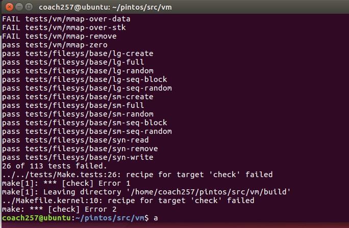

# PROJECT 3: VIRTUAL MEMORY DESIGN DOCUMENT

[TOC]

## GROUP

> Fill in the names and email addresses of your group members.

| NAME | SID | MAIL | RATIO |
| - | - | - | - |
| 朱英豪 | 18373722 | 18373722@buaa.edu.cn | 25% |
| 施哲纶 | 18373044 | 18373044@buaa.edu.cn | 25% |
| 胡鹏飞 | 18373059 | 18373059@buaa.edu.cn | 25% |
| 朱晨宇 | 18373549 | 18373549@buaa.edu.cn | 25% |

> 主要负责内容

| NAME | RESPONSIBLE FOR |
| - | - |
| 朱英豪 | 需求、思路设计；文档编写 |
| 施哲纶 | 具体算法实现；文档审核 |
| 胡鹏飞 | 项目前期调研；理解Pintos |
| 朱晨宇 | 负责Debug，代码风格检查 |

> Github记录

> 样例通过情况

## PRELIMINARIES

> If you have any preliminary comments on your submission, notes for the TAs, or extra credit, please give them here.

我们该项目的Github仓库为私有仓库，如有需要，请联系我们。

> Please cite any offline or online sources you consulted while preparing your submission, other than the Pintos documentation, course text, lecture notes, and course staff.

1. 操作系统概念(原书第9版)/(美)Abraham Silberschatz等著
2. 原仓周老师PPT中的概念和课上讲解

## QUESTION 1: PAGE TABLE MANAGEMENT

### DATA STRUCTURES

> A1: Copy here the declaration of each new or changed `struct` or `struct` member, global or static variable, `typedef`, or enumeration.  Identify the purpose of each in 25 words or less.

在本部分中，添加的新的数据结构或者是修改已有的数据结构。有：

**in `thread.h`**

- [NEW] `struct list child_list`
  - 定义子进程列表来储存父进程的所有子进程
- [NEW] `struct list_elem cpelem`
  - 定义`child_list`的`elem`
- [NEW] `tid_t parent_tid`
  - 定义父进程的`tid`

**in `process.c`**

- [CHANGED] `process_execute()`
  - implement starts a new thread running a user program loaded from FILENAME.
- [CHANGED] `start_process()`
  - implement 参数传递

### ALGORITHMS

> A2: In a few paragraphs, describe your code for accessing the data stored in the SPT about a given page.

> A3: How does your code coordinate accessed and dirty bits between kernel and user virtual addresses that alias a single frame, or alternatively how do you avoid the issue?

### SYNCHRONIZATION

> A4: When two user processes both need a new frame at the same time, how are races avoided?

### RATIONALE

> A5: Why did you choose the data structure(s) that you did for representing virtual-to-physical mappings?

## QUESTION 2: PAGING TO AND FROM DISK

### DATA STRUCTURES

> B1: Copy here the declaration of each new or changed `struct` or `struct` member, global or static variable, `typedef`, or enumeration.  Identify the purpose of each in 25 words or less.

**全局变量**

- [NEW] `struct lock file_lock`
  - 定义文件锁来限制多个线程同时修改同一个文件
- [NEW] `typedef int pid_t`
  - 定义线程标识号的类型
- [NEW] `int fd_num`
  - 定义非负整数file descriptor
- [NEW] `struct fd`
  - 定义新的结构体来表示一个线程打开的文件
- [NEW] `struct thread* parent`
  - 表示线程的父进程

**in `struct thread`**

- [NEW] `struct list fd_list`
  - 表示线程拥有的fd列表
- [NEW] `struct list fd_list`
  - 表示线程拥有的fd列表
- [NEW] `struct list child_status`
  - 表示子进程状态列表
- [NEW] `struct file *execfile`
  - 表示线程正在执行的文件
- [NEW] `struct child_process_status *relay_status`
  - 表示转发给父进程的子进程状态
- [NEW] `struct semaphore sema`
  - 表示子进程等待的信号量

**in `struct child_process_status`**

- [NEW] `struct int ret_status`
  - 表示子进程的返回状态
- [NEW] `struct int tid`
  - 表示子进程的tid
- [NEW] `struct thread* child`
  - 表示指向子进程的指针
- [NEW] `bool finish`
  - 表示子进程是否完成的状态
- [NEW] `bool iswaited`
  - 表示子进程是否等待的状态
- [NEW] `bool loaded`
  - 表示子进程是否等待的状态
- [NEW] `struct list_elem elem`
  - 表示子进程状态结构体的列表元素

### ALGORITHMS

> B2: When a frame is required but none is free, some frame must be evicted.  Describe your code for choosing a frame to evict.

> B3: When a process P obtains a frame that was previously used by a process Q, how do you adjust the page table (and any other data structures) to reflect the frame Q no longer has?

> B4: Explain your heuristic for deciding whether a page fault for an invalid virtual address should cause the stack to be extended into the page that faulted.

### SYNCHRONIZATION

> B5: Explain the basics of your VM synchronization design. In particular, explain how it prevents deadlock.  (Refer to the textbook for an explanation of the necessary conditions for deadlock.)

> B6: A page fault in process P can cause another process Q's frame to be evicted.  How do you ensure that Q cannot access or modify the page during the eviction process?  How do you avoid a race between P evicting Q's frame and Q faulting the page back in?

> B7: Suppose a page fault in process P causes a page to be read from the file system or swap.  How do you ensure that a second process Q cannot interfere by e.g. attempting to evict the frame while it is still being read in?

> B8: Explain how you handle access to paged-out pages that occur during system calls.  Do you use page faults to bring in pages (as in user programs), or do you have a mechanism for "locking" frames into physical memory, or do you use some other design?  How do you gracefully handle attempted accesses to invalid virtual addresses?

### RATIONALE

> B9: A single lock for the whole VM system would make synchronization easy, but limit parallelism.  On the other hand, using many locks complicates synchronization and raises the possibility for deadlock but allows for high parallelism. Explain where your design falls along this continuum and why you chose to design it this way.

## QUESTION 3: MEMORY MAPPED FILES
### ALGORITHMS

> C2: Describe how memory mapped files integrate into your virtual memory subsystem.  Explain how the page fault and eviction processes differ between swap pages and other pages.

> C3: Explain how you determine whether a new file mapping overlaps any existing segment.

### RATIONALE

> C4: Mappings created with "mmap" have similar semantics to those of data demand-paged from executables, except that "mmap" mappings are written back to their original files, not to swap.  This implies that much of their implementation can be shared. Explain why your implementation either does or does not share much of the code for the two situations.

## SURVEY QUESTIONS

Answering these questions is optional, but it will help us improve the course in future quarters. Feel free to tell us anything you want--these questions are just to spur your thoughts. You may also choose to respond anonymously in the course evaluations at the end of the quarter.

> In your opinion, was this assignment, or any one of the three problems in it, too easy or too hard?  Did it take too long or too little time?

这个作业对我们而言非常难。我们基本上整整10天其他什么作业都没做，只用来理解和写Pintos。

> Did you find that working on a particular part of the assignment gave you greater insight into some aspect of OS design?

是的。尤其是`process_wait()`的部分，如何引入信号量，如何周全地考虑父子进程先后退出的同步问题，如何适当地释放资源，这些考虑使我们对OS的理解得到了很大的提升。

> Is there some particular fact or hint we should give students in future quarters to help them solve the problems?  Conversely, did you find any of our guidance to be misleading?

实验指导书已经足够明确，我们组在做本次Project 3的唯一参考基本上就是该实验指导书。

> Do you have any suggestions for the TAs to more effectively assist students, either for future quarters or the remaining projects?

希望助教能给我们更多的指导，比如在开始的时候带领我们理解一下实验的任务要求，用户进程相关的知识背景，以及核心代码的部分讲解。

> Any other comments?

感谢在实验过程中解答我们问题的每一位助教！
