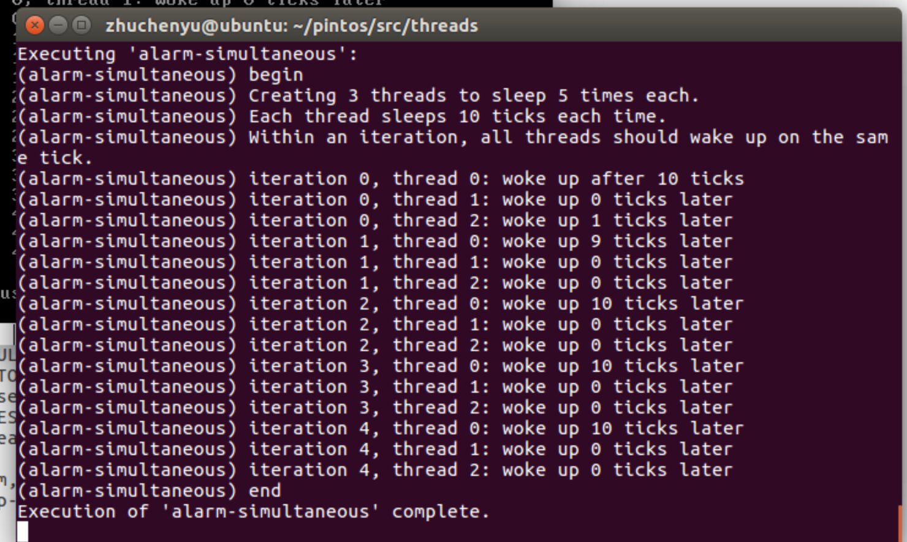

# PROJECT 1: THREADS DESIGN DOCUMENT

## GROUP

> Fill in the names and email addresses of your group members.

| 姓名   | 学号     | 邮箱         | 占比 |
| ------ | -------- | ------------ | ---- |
| 朱英豪 | 18373722 | 18373722@buaa.edu.cn | 25%  |
| 施哲纶 | 18373044 | 18373044@buaa.edu.cn | 25%  |
| 胡鹏飞 | 18373059 | 18373059@buaa.edu.cn | 25%  |
| 朱晨宇 | 18373549 | 18373549@buaa.edu.cn | 25%  |

> 主要负责内容

| 姓名   | ALARM CLOCK              | PRIORITY SCHEDULING | ADVANCED SCHEDULER |
| ------ | ------------------------ | ------------------- | ------------------ |
| 朱英豪 | 需求、思路设计；文档编写 |                     |                    |
| 施哲纶 | 具体算法实现；文档编写   |                     |                    |
| 胡鹏飞 | 项目前期调研；理解Pintos |                     |                    |
| 朱晨宇 | 负责Debug，代码风格检查  |                     |                    |

> Github记录

> 样例通过情况

(具体谁完成了哪个函数的编写与Debug在代码中也有注释注明，我们的分工基本上是相当合理且平均的)

## PRELIMINARIES

> If you have any preliminary comments on your submission, notes for the
> TAs, or extra credit, please give them here.

> Please cite any offline or online sources you consulted while
> preparing your submission, other than the Pintos documentation, course
> text, lecture notes, and course staff.

1. 操作系统概念(原书第9版)/(美)Abraham Silberschatz等著
2. 原仓周老师PPT中的概念和课上讲解

## QUESTION 1: ALARM CLOCK

### 需求分析

初始程序中通过忙等待机制来实现`timer_sleep`函数。但是这种忙等待机制的实现方式会过多的占用计算机系统的资源，对于某些资源分配不足的计算机系统（比如本组实验使用的Ubuntu虚拟机），难以通过第一部分的部分测试数据点(比如`alarm_simultaneous/alarm_priority`)。这是因为忙等待通过轮询的方式，在每个时间片将每个线程都放入`running`中运行以判断是否达到睡眠时间，并且将没有达到睡眠时间的线程重新放回`ready_list`中等待下一次的轮询。使用这种忙等待机制/轮询的方法，在每一个时间片中，需要进行太多的工作，以至于在资源分配不足的情况下无法在一个时间片中执行完成本应该在一个时间片中执行完毕的工作。



如上图。iteration为0的三个threads应该在同一个ticks中完成，iteration为1的thread应该在iteration=0的点完成后相差10个ticks才能完成（比如后面3和4的情况那样）。但thread2在iteration0中，由于上文所说的原因，不能在同一个时间片中完成，与thread 1相差1个ticks。

### 设计思路

拿到题目之后，发现了原先代码的什么问题，我们想到什么方式来解决，我们是大概是怎么解决的...

### DATA STRUCTURES

> A1: Copy here the declaration of each new or changed `struct` or
> `struct` member, global or static variable, `typedef`, or
> enumeration.  Identify the purpose of each in 25 words or less.
- `int64_t ticks_blocked`
  - 记录线程应该被阻塞的时间
- `struct list_elem bloelem;`
  - List element：在Blocked list中的list element，用来存储被阻塞的线程
- `void thread_sleep_block (void);`
  - 把当前运行中判断为需要睡眠的线程中的元素放入blocked list中，设置线程状态为THREAD_BLOCKED
- `static struct list blocked_list;`
  - 被阻塞的线程列表：当线程在阻塞（睡眠）过程中会被放入这个列表，在唤醒时会被移除
- `void blocked_thread_check(struct thread *t, void *aux UNUSED)`
  - t线程需要的睡眠时间片减一；检查当前t线程是否已睡醒：如果应该在睡眠状态，则继续放在list里，否则移出`blocked_list`
- `void blocked_thread_foreach(thread_action_func *func, void *aux)`
  - 对所有阻塞线程执行`func`,传递`aux`，必须阻塞中断

### ALGORITHMS

> A2: Briefly describe what happens in a call to timer_sleep(),
> including the effects of the timer interrupt handler.
(简述调用timer_sleep()后发生了什么，包括时间中断处理的效果)

- `timer_sleep()`  

```
判断正在运行中的线程需要的睡眠时间是否大于0，是则继续，否则return
禁用中断
设置当前线程的ticks_blocked为ticks，即保存该线程需要睡眠的时间
将该线程放入blocked_list队列，并设置状态为THREAD_BLOCKED
还原线程中断状态
```

- `timer_interrupt()`

```
更新当前系统时间片 
遍历blocked_list中所有的线程，执行第三步
该线程的ticks_blocked--
判断ticks_blocked是否为0，如果是则执行第五步，否则遍历下一个线程，执行第三步
禁用中断
将该线程从blocked_list中移除
将线程放入ready_list队列中，并将status设置为THREAD_READY
还原中断状态
遍历下一个线程直至遍历完blocked_list中所有线程
```

**Effects**

将此时可以唤醒的程序唤醒，放入准备运行的队列，并且从阻塞队列中移除

> A3: What steps are taken to minimize the amount of time spent in
> the timer interrupt handler?

1. 每次遍历阻塞队列都会将所有被唤醒的线程移除队列，这保证了每次`timer_interrupt()`所遍历的线程都一定是沉睡的，不会有正在运行的线程或者准备运行的线程，节省了遍历的时间。
2. 在线程结构体中存储了需要沉睡的时间，在一个时间片内遍历所有沉睡的线程的结构体即可，不需要调取线程进行忙等待，大大节省了时间。

### SYNCHRONIZATION

> A4: How are race conditions avoided when multiple threads call
> timer_sleep() simultaneously?

```c
enum intr_level old_level = intr_disable ();
list_remove(&t->bloelem); // 从blocked_list中移除
thread_unblock(t); // 解锁
intr_set_level (old_level);
```

- 通过以上的原子操作，当中断发生时，禁用对list的操作

> A5: How are race conditions avoided when a timer interrupt occurs
> during a call to timer_sleep()?

- 将中断禁用

### RATIONALE

> A6: Why did you choose this design?  In what ways is it superior to
> another design you considered?

- 避免了忙等待问题，节省资源空间
- 牺牲空间，节省时间
  - 我们多开了一个队列，保存阻塞的睡眠线程，使得每一次tick遍历时，只需要遍历睡眠的线程，而不需要遍历所有的线程（等待运行的线程、正在运行的线程以及睡眠中的线程）

## QUESTION 2: PRIORITY SCHEDULING

我们在做这道题时，根据测试结果，将其分成了若干阶段，或称之为将问题分解为了几个Part。以下，我们将对各个Part进行需求分析与思路分析。

- Part 1: 优先队列的设计与实现
- Part 2: 优先级捐赠的设计与实现

### 需求分析

在这个问题中，我们要实现线程根据其优先级

#### Part 1


结果：


#### Part 2

### 设计思路

### DATA STRUCTURES

> B1: Copy here the declaration of each new or changed `struct` or
> `struct` member, global or static variable, `typedef`, or
> enumeration.  Identify the purpose of each in 25 words or less.

> B2: Explain the data structure used to track priority donation.
> Use ASCII art to diagram a nested donation.  (Alternately, submit a
> .png file.)

### ALGORITHMS

> B3: How do you ensure that the highest priority thread waiting for
> a lock, semaphore, or condition variable wakes up first?

> B4: Describe the sequence of events when a call to lock_acquire()
> causes a priority donation.  How is nested donation handled?

> B5: Describe the sequence of events when lock_release() is called
> on a lock that a higher-priority thread is waiting for.

### SYNCHRONIZATION

> B6: Describe a potential race in thread_set_priority() and explain
> how your implementation avoids it.  Can you use a lock to avoid
> this race?

### RATIONALE

> B7: Why did you choose this design?  In what ways is it superior to
> another design you considered?

## QUESTION 3: ADVANCED SCHEDULER

### DATA STRUCTURES

> C1: Copy here the declaration of each new or changed `struct` or
> `struct` member, global or static variable, `typedef`, or
> enumeration.  Identify the purpose of each in 25 words or less.

### ALGORITHMS

> C2: Suppose threads A, B, and C have nice values 0, 1, and 2.  Each
> has a recent_cpu value of 0.  Fill in the table below showing the
> scheduling decision and the priority and recent_cpu values for each
> thread after each given number of timer ticks:

| timerticks | recent_cpu A | recent_cpu B | recent_cpu C | priority A | priority B | priority C | thread to run |
| ---------- | ------------ | ------------ | ------------ | ---------- | ---------- | ---------- | ------------- |
|            |              |              |              |            |            |            |               |
|            |              |              |              |            |            |            |               |
|            |              |              |              |            |            |            |               |
|            |              |              |              |            |            |            |               |
|            |              |              |              |            |            |            |               |
|            |              |              |              |            |            |            |               |
|            |              |              |              |            |            |            |               |
|            |              |              |              |            |            |            |               |
|            |              |              |              |            |            |            |               |
|            |              |              |              |            |            |            |               |
|            |              |              |              |            |            |            |               |


> C3: Did any ambiguities in the scheduler specification make values
> in the table uncertain?  If so, what rule did you use to resolve
> them?  Does this match the behavior of your scheduler?

> C4: How is the way you divided the cost of scheduling between code
> inside and outside interrupt context likely to affect performance?

### RATIONALE

> C5: Briefly critique your design, pointing out advantages and
> disadvantages in your design choices.  If you were to have extra
> time to work on this part of the project, how might you choose to
> refine or improve your design?

> C6: The assignment explains arithmetic for fixed-point math in
> detail, but it leaves it open to you to implement it.  Why did you
> decide to implement it the way you did?  If you created an
> abstraction layer for fixed-point math, that is, an abstract data
> type and/or a set of functions or macros to manipulate fixed-point
> numbers, why did you do so?  If not, why not?

## SURVEY QUESTIONS

Answering these questions is optional, but it will help us improve the
course in future quarters.  Feel free to tell us anything you
want--these questions are just to spur your thoughts.  You may also
choose to respond anonymously in the course evaluations at the end of
the quarter.

> In your opinion, was this assignment, or any one of the three problems
> in it, too easy or too hard?  Did it take too long or too little time?

> Did you find that working on a particular part of the assignment gave
> you greater insight into some aspect of OS design?

> Is there some particular fact or hint we should give students in
> future quarters to help them solve the problems?  Conversely, did you
> find any of our guidance to be misleading?

> Do you have any suggestions for the TAs to more effectively assist
> students, either for future quarters or the remaining projects?

> Any other comments?